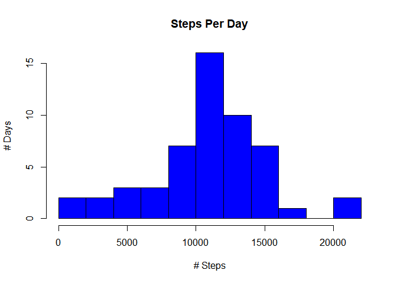
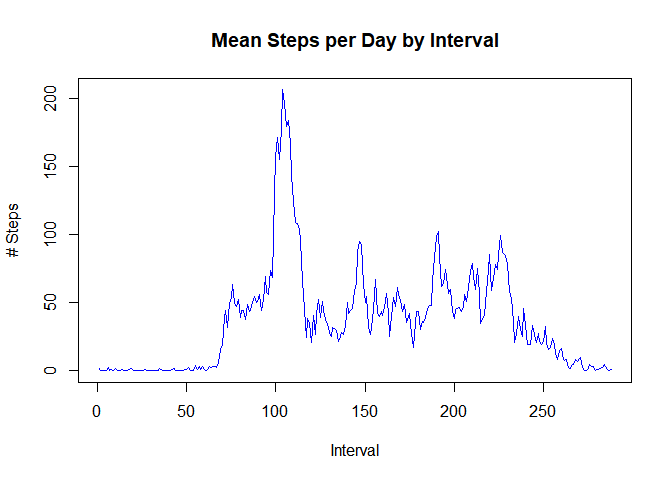
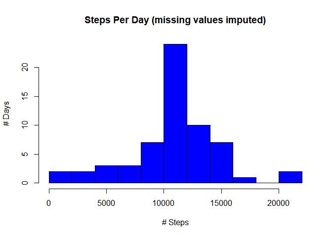
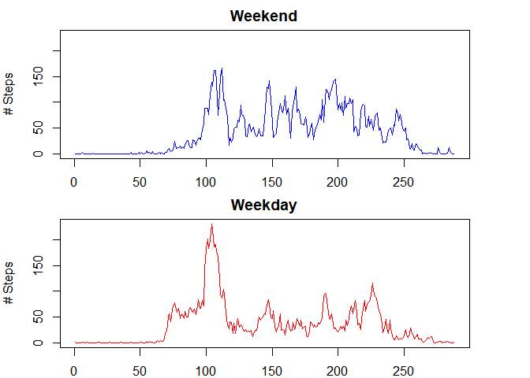

```r
library(dplyr)
```

```
## 
## Attaching package: 'dplyr'
```

```
## The following objects are masked from 'package:stats':
## 
##     filter, lag
```

```
## The following objects are masked from 'package:base':
## 
##     intersect, setdiff, setequal, union
```

```r
library(lubridate)
```

```
## 
## Attaching package: 'lubridate'
```

```
## The following object is masked from 'package:base':
## 
##     date
```

## Loading and preprocessing the data
1. Load Data

```r
activitydata <- read.csv("activity.csv")
head(activitydata)
```

```
##   steps       date interval
## 1    NA 2012-10-01        0
## 2    NA 2012-10-01        5
## 3    NA 2012-10-01       10
## 4    NA 2012-10-01       15
## 5    NA 2012-10-01       20
## 6    NA 2012-10-01       25
```

## What is mean total number of steps taken per day?

1. Calculate steps per day


```r
totsteps<-aggregate(steps~date, data=activitydata, sum)
head(totsteps)
```

```
##         date steps
## 1 2012-10-02   126
## 2 2012-10-03 11352
## 3 2012-10-04 12116
## 4 2012-10-05 13294
## 5 2012-10-06 15420
## 6 2012-10-07 11015
```

2. Generate histogram


```r
hist(totsteps$steps, breaks=10, col="blue", main="Steps Per Day", ylab="# Days", xlab="# Steps")
```

<!-- -->

3. Calculate mean and median number steps per day


```r
meansteps<-as.integer(mean(totsteps$steps))
mediansteps<-as.integer(median(totsteps$steps))
```

The mean number of steps per day is 10766 and the median is 10765

## What is the average daily activity pattern?

1. Calculate mean steps for each 5 minute interval over all days, and create a time series plot


```r
## convert interval to a factor
activitydata$interval <- as.factor(activitydata$interval)

## calculate average steps per interval
meanstepsint <- tapply(activitydata$steps, activitydata$interval, mean, na.rm = TRUE)

## plot the mean steps
plot(meanstepsint, type="l", col="blue", main="Mean Steps per Day by Interval", xlab="Interval", ylab="# Steps")
```

<!-- -->

2. Which 5 minute interval contains the most steps?


```r
## Find interval with the maximum steps
maxsteps<-which.max(meanstepsint)
maxsteps
```

```
## 835 
## 104
```

## Imputing missing values
1. Calculate the number of missing values.

```r
sum(is.na(activitydata$steps))
```

```
## [1] 2304
```
2. Strategy for imputing missing values:  

I will use the median of the 5 minute intervals.

3. Create a new data set with the values filled in


```r
## create copy of data
activitydata2 <- activitydata
## loop through and find & replace missing values
for (i in 1:length(activitydata2$steps)) {
  if (is.na(activitydata2$steps[i])) {
  activitydata2$steps[i] <-     mean(activitydata2$steps[activitydata2$interval == activitydata2$interval[i]],na.rm = "True") }}         
```

4. Create histogram of the total number of steps taken each day and Calculate and report the mean and median total number of steps taken per day. Do these values differ from the estimates from the first part of the assignment? What is the impact of imputing missing data on the estimates of the total daily number of steps?


```r
totsteps2<-aggregate(steps~date, activitydata2 ,sum)
hist(totsteps2$steps, breaks=10, col="blue", main="Steps Per Day (missing values imputed)", ylab="# Days", xlab="# Steps")
```

<!-- -->

```r
meansteps2<-as.integer(mean(totsteps2$steps))
mediansteps2<-as.integer(median(totsteps2$steps))
```
The mean number of steps per day is 10766 and the median is 10766

The mean and median are now equal.

## Are there differences in activity patterns between weekdays and weekends?


```r
## create factor variable for type of day
activitydata2$date <- ymd(activitydata2$date)
activitydata2 <- mutate(activitydata2, day= ifelse(weekdays(activitydata2$date) %in% c("Saturday","Sunday"), "Weekend", "Weekday"))
activitydata2$day <- as.factor(activitydata2$day)

## calculate mean number steps by day type
meanstepsweekday<- tapply(activitydata2$steps[activitydata2$day == "Weekday"], activitydata2$interval[activitydata2$day == "Weekday"], mean)
meanstepsweekend <- tapply(activitydata2$steps[activitydata2$day == "Weekend"], activitydata2$interval[activitydata2$day == "Weekend"], mean)

## Create panel plot
par(mfrow=c(2,1), mar=c(2,4,2,4))
plot(meanstepsweekend, type="l", col="blue", ylim=c(0,max(meanstepsweekend,meanstepsweekday)), main="Weekend", xlab="Interval", ylab="# Steps")
plot(meanstepsweekday, type="l", col="red", ylim=c(0,max(meanstepsweekend,meanstepsweekday)),main="Weekday", xlab="Interval", ylab="# Steps")
```

<!-- -->
